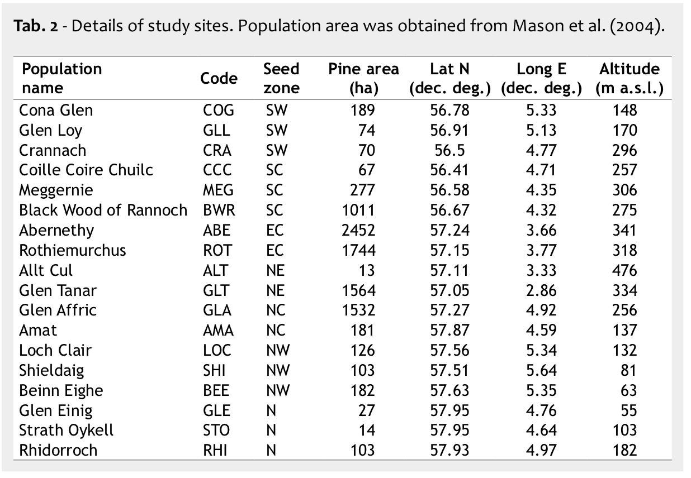
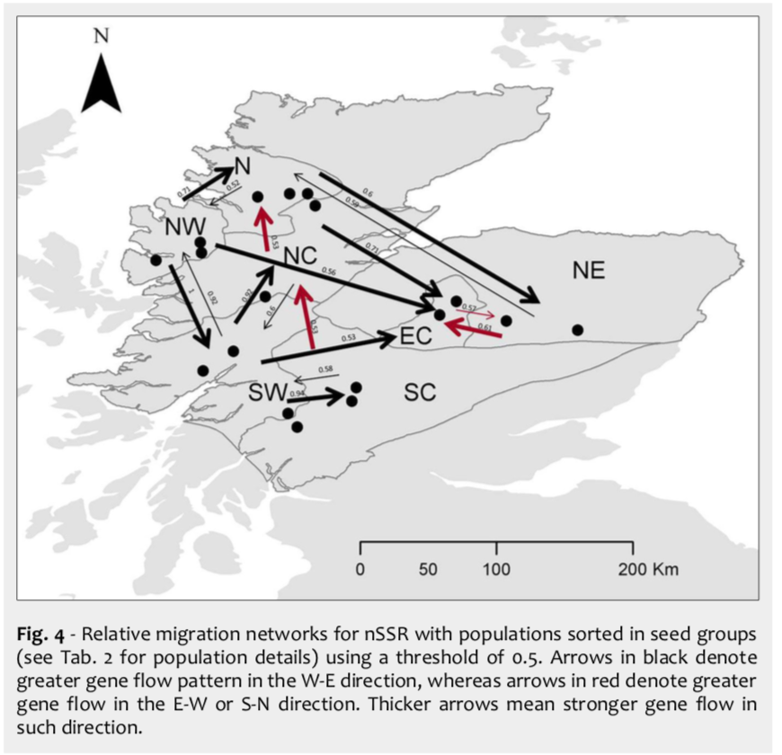
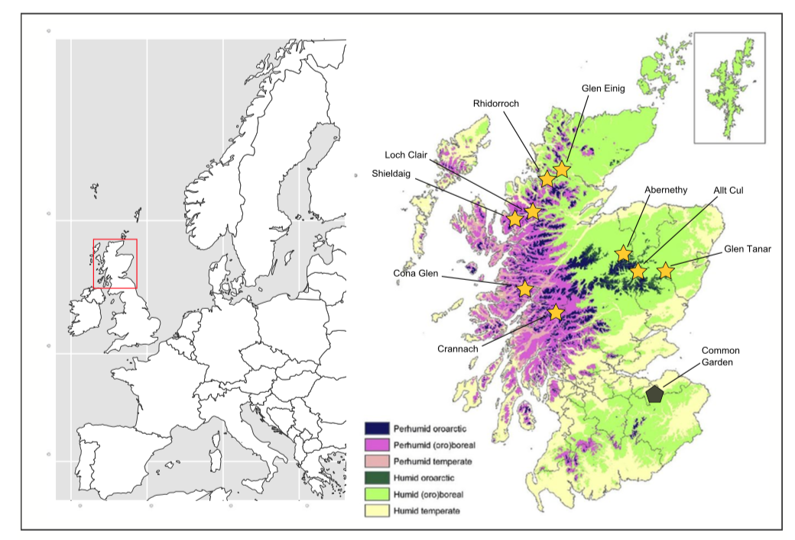
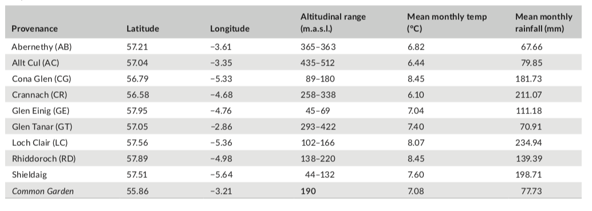
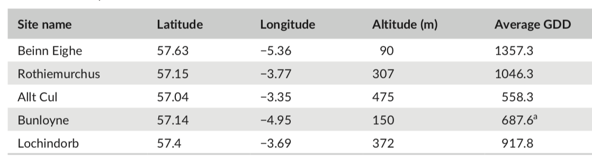

% General reading notes for weevils project
% John Godlee

# Gonzalez-Diaz et al. 2017 - Ecology and management history drive spatial genetic structure in Scots pine

Study of the effects of historical and contemporary forest management (intense felling / natural regeneration) on genetic diversity in _Pinus sylvestris_

__This is not from the common garden experiment__


# Gonzalez-Diaz et al. 2018 - Weak isolation by distance and geographic diversity gradients persist in Scottish relict pine forest

> The importance of including genetic factors in sustainable forest management has been strongly supported in recent years (FAO 2014, Fady et al. 2016b)

> The fragmented natural Scots pine (_Pinus sylvestris_) forests of Scotland represent the westernmost extreme of the species' native range, separated by at least 500 km from natural stands in mainland Europe.

Populations have been found to be genetically distinct (Wachowiak et al. 2011, Sinclair et al. 1998)



They use three letter codes to refer to their site locations, e.g. (AMA = Amat, ROT = Rothiemurchus)

84 fragments of ancient native pine forest remain in Scotland, over a total area of 17,882 Ha (Mason et al. 2004).

They sampled all of my sites except: 

* Glen Cannich
* Glen Derry
* Ballochuie

They used Bayesian clustering to assess population relatedness



Only a weak pattern of isolation by distance and very low population differentiation (~2% of the genetic variation among populations)

Some authors have suggested multiple origins for the Scottish population of trees, and this study supports that, with finding wide genetic variation, which wouldn't be likely if the population was a single refugia.

Caveats: The western most population (SHI) was most differentiated from other populations (this has also been reported by other authors)

Prevailing wind may lead to increased isolation by distance as you go further west.

There have been extensive Scot's Pine plantations established throughout the UK in the last century, so it would be interesting to understand the impact these plantations might have on the genetic diversity of future scots pine generations


# Donnelly et al. 2018 - Cryptic genetic variation and adaptation to waterlogging in Caledonian Scots pine, Pinus sylvestris L.

Physiological responses to drought measured through Fv/Fm chlorophyll fluorescence

The reduction in Fv/Fm was greater in individuals originating from drier eastern sites.

> In view of a changing climate, we note that comparitively maladapted populations may possess considerable adaptive potential, due to cryptic genetic variation, that should not be overlooked.

Populations of Scot's pine in Scotland range from 3000 mm/yr in the west to 800 mm/yr in the east. Those populations in the west tend to occupy a milder climate with lower average elevations. Soils are generally more free draining in the east than the west.

> We exposed saplings, __grown from seed collected in populations across the natural longitudinal range of Caledonian pine__, to contrasting nonflooded and flooded treatments in a control experiment.





They used linear mixed effects models during the analysis, Fv/Fm was odds-transformed to improve the normality of the residuals: odds = "fvfm" / 1 - "fvfm"

They used `MuMIn` package to generate models with all possible combinations of fixed effects (Barton 2013)

As covariates they included rainfall and longitude of site. Family and plot were random effects.

Compared models using AICc

They used `nlme` to test whether auto-correlation structures improved model fit (Pinheiro, Bates, Debroy & Sarkar, 2018) 

They used interaction plots to show the difference between treatments 

They expect that populations to the west (wetter) to have been exposed to waterlogging more often and therefore have less cryptic variation for fitness under flooding.


# Whittet et al. 2017 - Substantial variation in the timting of pollen production reduces reproductive synchrony between distant populations of Pinus sylvestris L. in Scotland

Timing of pollination in-situ was negatively correlated with results from a common garden experiment, indicative of a pattern of counter-gradient variation.

They hypothesise that continually warming, or asymmetrically carming spring temperatures will decrease reproductive synchrony among pine populations

Caledonian pinewoods are throught to represent only 1% of former maximum distribution of Scots pine (McVean & Ratcliffe, 1962).

There is evidence from other studies that these populations of Scots pine are genetically differentiated for a range of adaptive traits:

* Donnelly et al. 2016
* Perry, Brown et al. 2016
* Perry, Wachowiak et al. 2016 
* Salmela et al. 2011
* Salmela et al. 2013

They used 5 field sites in the group:

* Beinn Eighe
* Bunloyne
* Lochindorb
* Rothiemurchus
* Allt Cul

Selection of field sites was based on an inventory of ancient semi-natural pinewoods known collectively as the Caledonian pinewoods (Forestry Commission, 1999)



The west-east gradient is the most important environmental gradient in Scotland.

> These sites were deliberately chosen because they were geographically far apart yet were readily accessible by road such that all could be visited in a single round trip.


# Dillon et al. 2006 - Suppression of the large pine weevil Hylobius abietis (L.) (Coleoptera: Curculionidae) in pine stumps by entomopathogenic nematodes with different foraging strategies

> The large pine weevil, _Hylobius abietis_ (L.) (Coleoptera: Curculionidae), is the most economically important forest pest in Northern and Eastern Europe (Langstrom & Day 2004, Leather et al. 1999).

> Hylobius abietis breeds in fresh conifer stumps and feeds on young seedlings; it is a major pest where clearfelling and replanting is practiced and represents a serious obstacle to successful reforestation (Orlander & Nilsson 1999).

> Seedlings have been reported to be susceptible to weevil damage for up to five years (Orlander et al. 1997, Selander 1993).

> In Ireland and Britain, _H. abietis_ is the only forest insect pest against which routine chemical control measures are applied (Ward et al. 1993, Willoughby et al. 2004).

> As a participant of the sustainable forest management (SFM) agreement, the European Union has agreed to reduce chemical usage and increase biodiversity when developing forestry.


# Lieutier et al. (eds.) 2004 - Bark and wood boring insects in living trees in Europe, a synthesis

__Part 2 - Bark weevils__

Genus _Hylobius_:

* 4 species found in Europe.
* _H. abietis_ and _H. pinastri_ are hard to tell apart.
* _H. abietis_ is very common in Europe from Siberia to northern Spain.
* It is considered the worst pest of young conifers.
* _H. abietis_ is more common than _H. pinastri_
* _H. pinastri_ is normally found in areas dominated by spruce and those that are more moist.

Breeds in conifer stumps and feeds on seedlings

_H. abietis_ also feeds on mature trees, but only causes damage to seedlings normally.

Previous damage on seedlings strongly increases the risk of subsequent attack by pine weevils due to the release of attractive host volatiles (Nordlander 1991, Bjorklund et al. 2003).

Scott and King (1974) developed the following feeding preference:

```
P. sylvestris -> B. pendula -> P. abies -> F. excelsior -> A. pseudoplatanus
```

Factors which may affect level of damage observed in seedlings:

* method of nursery production (Selander et al. 1990, Selander 1993, von Sydow 1997)
* plant size (Eidmann 1969, Selander 1993, Thorsen et al. 2001)
    * Larger plants (bigger stem diameter) are less likely to be killed by weevil attack. Lower probability of girdling.
    * But larger plants tend to accumulate more feeding damage (Eidmann 1969)
* Scarification of soil around transplants (Langstrom 1993, von Sydow 1997)
* Insolation (von Sydow & Orlander 1994)
* Presence of branches and other felling residues around the plants (Selander 1993)

Only very few studies have investigated possible resistance mechanisms and there have been no systematic studies of genetic variation in resistance to Weevil damage.

The monoterpene, alpha-pinene which is released from both root stumps and transplants is attractive to weevils (Selander et al. 1973 ,1974, Kalo et al. 1974, Mustaparta 1974, 1975b)

Wounding of bark either mechanically or through feeding increases attractiveness to__H. abietis_ through the release of monoterpenes (Tilles 1986b, Nordlander 1991, Zagatti et al. 1997)

_H. abietis_ can carry damaging fungi with them, leading to secondary damage, e.g. _Heterobadidion annosum coll._ (Fr.) Bref. Also, _Leptographium procerum_ (Levieux et al. 1994a).

The UK reports 30-100% mortality unless seedlings are properly protected. (R. Moore)

> The roles of the genetic make up, physiological condition, morphological properties and defense chemistry of seedlings in avoiding and/or sustaining attack by pine weevils should hence be studied in a more systematic way, as seedling properties will probably be important components in future pest management systems.


